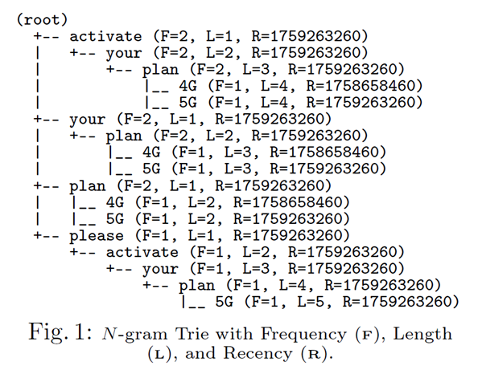
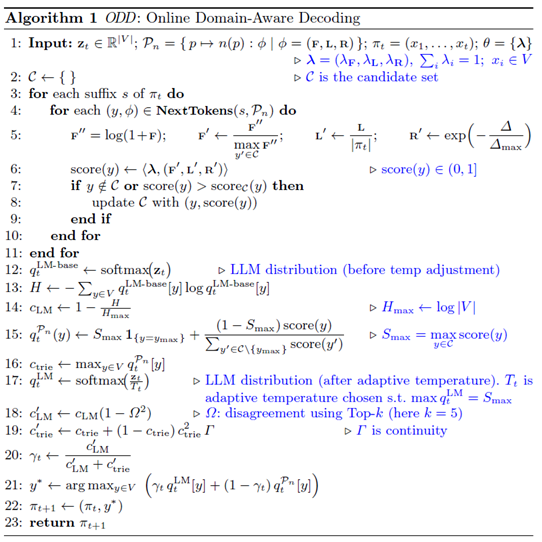
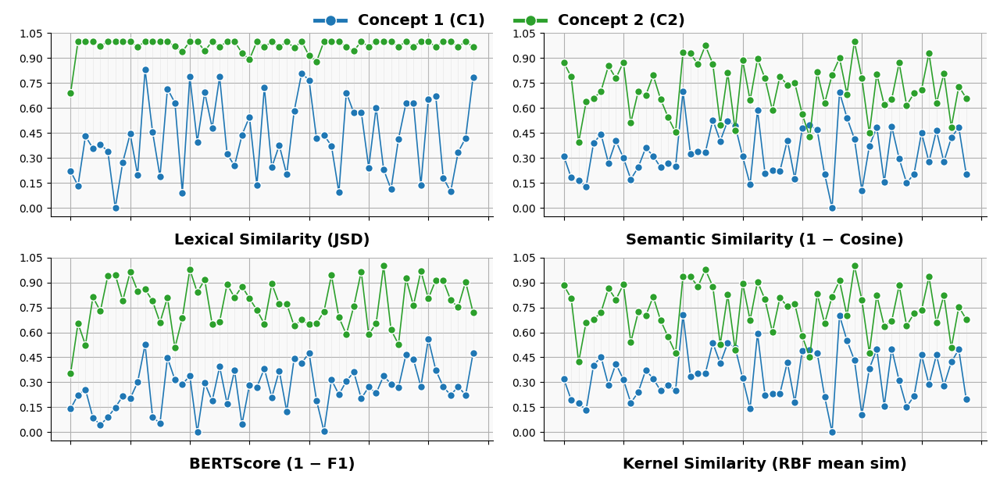
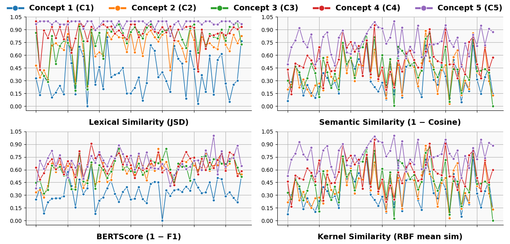
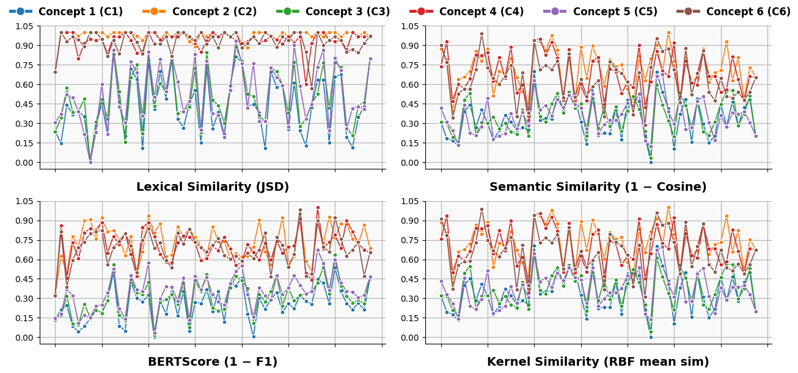
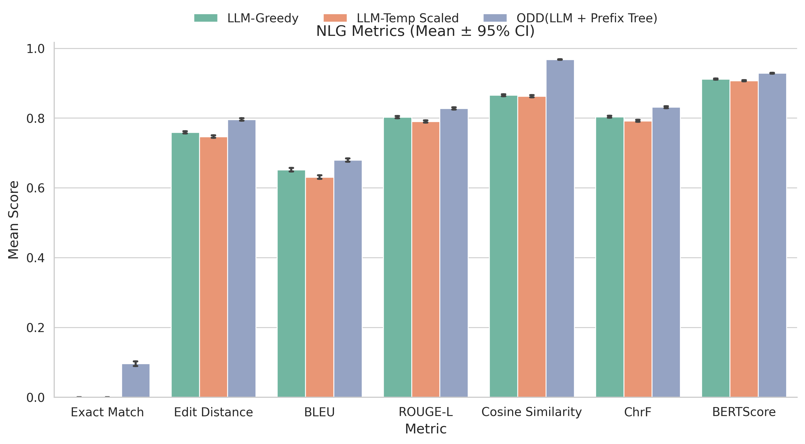
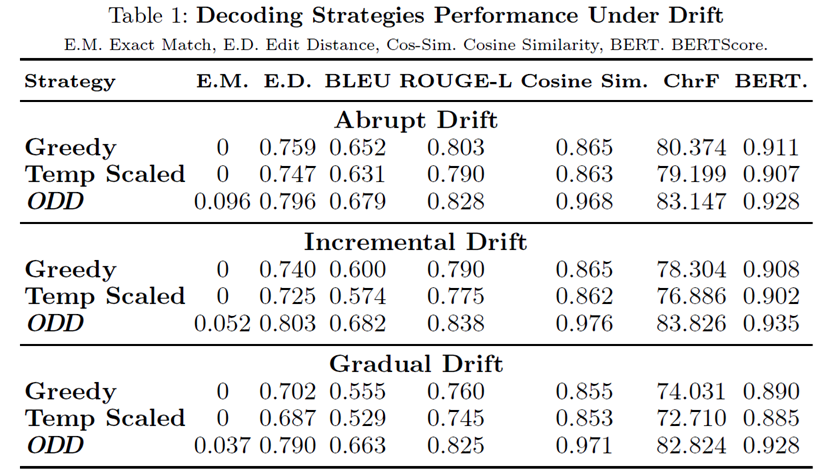

# **ODD – Online Domain-Aware Decoding**

**ODD (Online Domain-Aware Decoding)** is an inference-time framework for real-time domain adaptation in Large Language Models (LLMs), requiring no retraining or external retrieval. ODD performs probability-level fusion between a base LLM and a prefix-tree prior, using adaptive confidence modulation driven by disagreement and continuity signals.

Experiments across multiple drift scenarios show that ODD consistently surpasses LLM-Greedy and LLM-Temp-Scaled. It achieves:

* **+0.065 absolute gain** in ROUGE-L
* **+13.6 percent relative improvement** in Cosine Similarity

These results demonstrate ODD’s robustness to evolving lexical and contextual patterns, making it suitable for dynamic, drift-prone LLM applications.

---

## **Key Contributions**

### **(a) First inference-time, online domain-aware decoding framework**

Introduces the first decoding-only approach for handling domain drift without fine-tuning, without retrieval, and without modifying model weights.

### **(b) Single-pass decoding with an Adaptive Fusion Mechanism**

Provides a single-pass architecture that dynamically balances:

* LLM fluency
* prefix-trie structural constraints

This balance is achieved through a runtime reward–penalty mechanism informed by:

* disagreement signals
* continuity signals

The mechanism ensures structural correctness while maintaining near-zero latency overhead.

### **(c) Lightweight prefix-trie for fast domain guidance**

A compact trie stores tokenized placeholders (not full contexts), enabling:

* O(L) updates
* O(L²) retrieval
* fast, linear-time lookup during decoding
* memory scaling only with the number of unique placeholders

This results in low computational overhead even in large domains.

### **(d) Strong empirical performance under domain shift**

Using a unified Online Domain Shift (ODS) benchmark covering abrupt, incremental, and gradual drift, ODD consistently outperforms baseline decoding methods across all NLG metrics, achieving:

* **+0.065 ROUGE-L** (absolute gain)
* **+13.6 percent Cosine Similarity** (relative gain)

These results validate ODD’s ability to adapt reliably to dynamic linguistic environments.

## **Trie Features Overview**

Each trie entry stores three features: **Recency (R)**, **Length (L)**, and **Frequency (F)**.

* **Recency (R)** tracks when a continuation last appeared.
* **Length (L)** measures how closely a prefix or span matches the query.
* **Frequency (F)** counts how frequently the sequence appears.

These features are updated at each node whenever new instances are inserted, enabling the trie to function as a dynamic scoring mechanism that reflects **temporal**, **structural**, and **statistical** relevance.

### **Example**

Consider two domain sequences inserted into the n-gram trie:

* **s₁**: “Activate your plan 4G” *(older)*
* **s₂**: “Please activate your plan 5G” *(more recent)*

For illustration, this example uses **word-level nodes**, while the actual implementation operates on **token-level sequences**.

The trie’s node-level features capture:

* **Recency (R)**

  * “4G” has an older timestamp
  * “5G” has the newer timestamp
* **Length (L)**

  * deeper paths reflect longer, more specific matches (e.g., L = 5 for the full “5G” path)
* **Frequency (F)**

  * shared prefixes such as `activate → your → plan` yield F = 2

---

## **ODD Algorithm**

---

## **Drift in Datasets**

### Abrupt Drift

### Incremental Drift

### Gradual Drift

---

## **Experimental Results**

